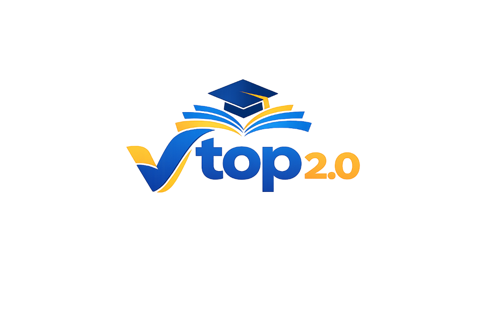

<div align="center">
  
  <h1>VTOP 2.0: The Digital Campus Sovereign</h1>
  <p><strong>Next-Generation University Management & Orchestration Engine</strong></p>
  <p><em>Built with Next.js 16 & React 19 • Designed with Obsidian Glass Aesthetic • Powered by Prisma</em></p>

  <div>
    
    
    
    
    
    
  </div>
</div>

---

## 🌌 The Grand Vision

**VTOP 2.0** is a complete reimagining of the legacy student information system. It bridges the gap between administrative complexity and user experience. Gone are the days of cluttered, 90s-style portals. VTOP 2.0 introduces the **Obsidian Glass** design language—a high-tech, translucent UI that feels alive with ambient mesh gradients and fluid motion orchestration.

It is an all-in-one ecosystem for research, academics, finance, and campus residency, designed to scale with the needs of a modern high-tier university.

---

## 🎭 Role-Based Sovereignty

VTOP 2.0 leverages advanced role-based access control (RBAC) to provide four distinct, tailored portals:

### 🎓 01. STUDENT NEXUS

The ultimate cockpit for the modern learner.

- **Academic Engine**: Interactive timetable, biometric attendance reports, and course content hubs.
- **The Research Forge**: Manage research profiles, submit thesis progress, and track publications.
- **Exam Oracle**: Digital Hall Tickets, real-time seat allocation, and re-evaluation portals.
- **Service Hub**: Automated Bonafide requests, Transcript services, and Library integration.
- **Residency Management**: Hostel admission, mess menu tracking, and maintenance ticketing.
- **Legacy Records**: Seamless access to grade history, result sheets, and academic milestones.

### 💼 02. FACULTY CABIN

Empowering educators with streamlined orchestration.

- **Lecture Management**: Real-time teaching schedule and biometric attendance override.
- **Grade Management**: Direct marks upload, assessment analytics, and grade processing.
- **Mentorship Hub**: Track proctees, schedule counselling, and monitor student progress.
- **Admin ledger**: Secure access to payroll, payslips, and personal residency records.

### 🛡️ 03. ADMIN ORACLE

Centralized control for institutional stability.

- **Engine Forge**: Direct monitoring of system health and database nodes.
- **Orchestration**: Manage university-wide alerts, system-level audits, and engine updates.
- **Identity Hub**: Granular control over student, faculty, and parent accounts.
- **Global Attendance**: Admin-level overrides and historical log analysis.

### 👪 04. PARENT GUARDIAN

Connecting transparency with peace of mind.

- **Ward Surveillance**: Real-time monitoring of attendance, marks, and performance history.
- **Communication Hub**: Direct bridge to the proctor and university administration.
- **Financial Ledger**: Consolidated tracking of all ward-related fees and dues.

---

## 🛠️ The Hyper-Modern Stack

- **Framework**: [Next.js 16 (App Router)](https://nextjs.org/) for server-side excellence and lightning-fast edge rendering.
- **Core**: [React 19](https://react.dev/) using the latest `use` and action patterns.
- **Database**: [Prisma ORM](https://www.prisma.io/) with a robust PostgreSQL foundation.
- **Auth**: [NextAuth.js](https://next-auth.js.org/) for multi-role credential security.
- **Style**: [Tailwind CSS](https://tailwindcss.com/) + [Tailwind Animate](https://github.com/jamiebuilds/tailwindcss-animate).
- **Motion**: [Framer Motion](https://www.framer.com/motion/) for cinematic UI transitions.
- **UI Components**: [Shadcn UI](https://ui.shadcn.com/) (Radix UI) logic with custom "Obsidian" skins.

---

## 📁 Repository Map

```bash
VTOP2.0
├── prisma/               # Database Schema & Seed Engine
├── public/               # Static Assets & Global Branded Logos
├── src/
│   ├── app/              # Next.js 16 App Router (The Core)
│   │   ├── (auth)/       # Secure Authentication Flows
│   │   ├── (dashboard)/  # Role-Based Hubs (Admin, Student, etc.)
│   │   └── api/          # Dynamic Serverless Endpoints
│   ├── components/       # Atomic & Molecule Component Library
│   │   ├── ui/           # Custom Obsidian shadcn components
│   │   └── widgets/      # Role-specific dashboard widgets
│   ├── lib/              # The Backend Logic (Actions & Utils)
│   │   ├── actions.ts    # Main Server Actions (100+ functions)
│   │   ├── auth.ts       # Secure NextAuth Configuration
│   │   └── prisma.ts     # Database Initialization Node
└── tailwind.config.ts    # Custom Design Tokens & Theme Engine
```

---

## 🚀 Instant Deployment

Deploy your own digital campus in minutes:

### 1. Propagation

```bash
git clone https://github.com/ArshVermaGit/Vtop2.0.git
cd Vtop2.0
npm install
```

### 2. Environment Synchronization

Create a `.env` in the root and provide your university's resonance:

```env
DATABASE_URL="postgresql://..."
NEXTAUTH_SECRET="your-secret-key"
NEXTAUTH_URL="http://localhost:3000"
```

### 3. Initialize the Matrix

```bash
npx prisma generate
npx prisma db push
npm run seed
```

### 4. Ignite the Engine

```bash
npm run dev
```

---

## 🎨 Aesthetic Philosophy: Obsidian Glass

VTOP 2.0 isn't just about functionality; it's about **emotion**. We use:

- **Depth & Translucency**: High-blur backdrops with fine 1px borders.
- **Ambient Life**: Subtle background mesh gradients that pulsate with system activity.
- **Typography Excellence**: Optimized font scales for heavy academic data readability.
- **Responsiveness**: A mobile-first approach ensuring the campus is in your pocket.

---

## 👨‍💻 The Creator

**Arsh Verma**  
_Full Stack Architect & UI/UX Visionary_  
[GitHub](https://github.com/ArshVermaGit) | [LinkedIn](https://linkedin.com/in/arshverma)

---

<div align="center">
  <p>© 2026 VTOP 2.0 • Engineering the Future of Academic Management.</p>
</div>
